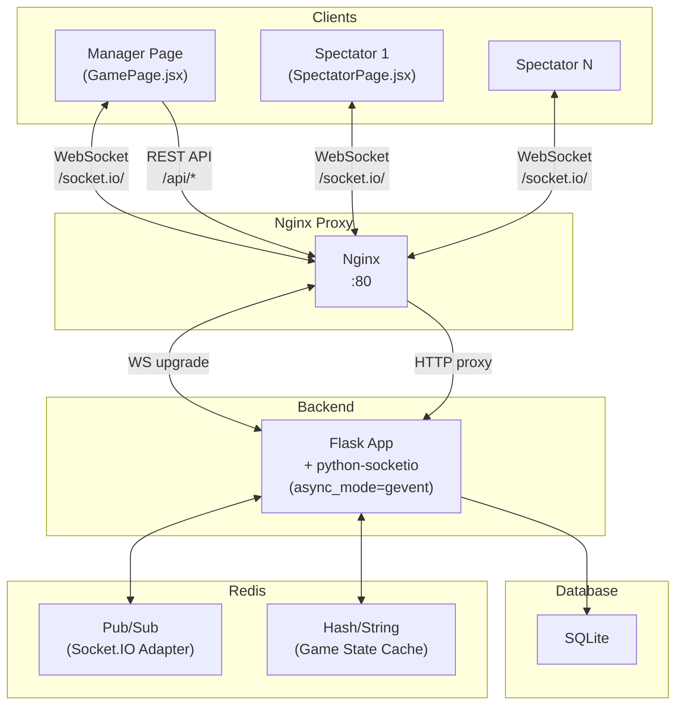
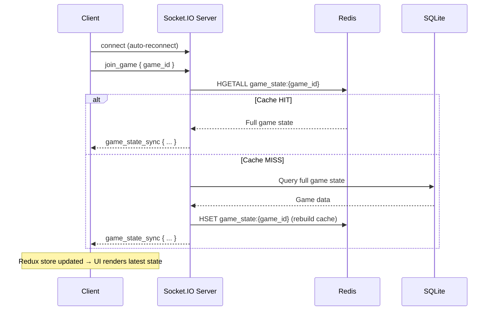

# Nâng cấp Real-time cho Tính năng "Cuộc chơi" (Game)

## 1. Tổng quan Hiện trạng

Hệ thống hiện tại hoạt động theo mô hình **Request-Response thuần túy**:
- **Backend**: Flask + SQLite + Gunicorn (4 workers)
- **Frontend**: React + Redux + Vite, gọi API qua Axios
- **Proxy**: Nginx reverse proxy
- **Deploy**: Docker Compose (3 containers: backend, frontend, proxy)

**Vấn đề**: Trang Spectator (`?role=view`) không tự cập nhật khi Manager thao tác. Người xem phải refresh thủ công để thấy thay đổi.

---

## 2. Kiến trúc Real-time Đề xuất

### 2.1. Sơ đồ Kiến trúc



### 2.2. Lựa chọn Công nghệ

| Thành phần | Công nghệ | Lý do |
|---|---|---|
| WebSocket Server | `python-socketio` + `gevent` | Tương thích Flask, hỗ trợ rooms, namespaces native |
| WebSocket Client | `socket.io-client` v4 | Official client, auto-reconnect, fallback polling |
| In-memory Cache | Redis Hash | Lưu game state tức thời, O(1) read, hỗ trợ TTL |
| Multi-worker Sync | Redis Pub/Sub (socketio adapter) | Đồng bộ events giữa Gunicorn workers |
| WSGI Server | `gevent` worker cho Gunicorn | Hỗ trợ long-lived WebSocket connections |

### 2.3. Tại sao chọn Gevent thay vì Eventlet?

`python-socketio` hỗ trợ cả 2 async mode: `gevent` và `eventlet`. Chọn **gevent** vì:

| Tiêu chí | Gevent | Eventlet |
|---|---|---|
| **Trạng thái phát triển** | Đang được maintain tích cực, cộng đồng lớn | Bảo trì chậm, nhiều issue mở không được fix |
| **Tương thích Python 3.12+** | ✅ Hỗ trợ tốt | ⚠️ Gặp vấn đề với Python 3.12+ (monkey-patching `ssl` bị lỗi) |
| **Hiệu năng** | Dùng `libev`/`libuv` C-based event loop → nhanh hơn | Pure-Python green threads → chậm hơn |
| **Gunicorn worker** | `geventwebsocket.gunicorn.workers.GeventWebSocketWorker` — ổn định | `eventlet.wsgi` — không được Gunicorn khuyến nghị cho production |
| **Tương thích PostgreSQL** | ✅ `psycopg2` + gevent hoạt động tốt (qua `psycogreen`) | ✅ Cũng hỗ trợ nhưng cần monkey-patch thêm |

> [!NOTE]
> **Tóm tắt**: Gevent ổn định hơn, hiệu năng tốt hơn, và đặc biệt không gặp vấn đề tương thích với Python 3.12+. Khi project migrate sang PostgreSQL sau này, gevent vẫn hoạt động tốt với `psycopg2`.

### 2.4. Luồng Dữ liệu Chính

```
Manager Action (ấn nút) 
  → REST API call (POST/PUT) 
    → Flask xử lý business logic + ghi SQLite
    → Cập nhật Redis Cache (game state mới nhất)
    → Emit Socket.IO event tới Room `game:{id}`
      → Tất cả clients trong room nhận event
        → Redux store cập nhật → UI re-render
```

> [!IMPORTANT]
> **Nguyên tắc cốt lõi**: REST API vẫn là "nguồn sự thật" (source of truth) cho mọi mutation. Socket.IO chỉ **broadcast thông báo** để clients biết state đã thay đổi. Điều này giữ cho logic đơn giản và tránh race conditions.

---

## 3. Cấu trúc Dữ liệu Redis

### 3.1. Game State Cache

```
Key: game_state:{game_id}
Type: Redis Hash
TTL: 24 giờ (tự xóa khi game không active)
```

```json
{
  "game": "{...serialized game object...}",
  "players": "[...serialized players array...]",
  "active_round": "{...serialized active round or null...}",
  "round_history": "[...serialized completed rounds...]",
  "updated_at": "2026-04-25T00:00:00Z"
}
```

### 3.2. Các Redis Operations

| Operation | Khi nào | Redis Command |
|---|---|---|
| Khởi tạo cache | Client đầu tiên join room | `HSET game_state:{id}` (full state từ SQLite) |
| Cập nhật state | Sau mỗi API mutation | `HSET game_state:{id} {field} {value}` |
| Đọc state | Client reconnect / join | `HGETALL game_state:{id}` |
| Xóa cache | Game kết thúc / bị xóa | `DEL game_state:{id}` |
| TTL | Đặt khi tạo | `EXPIRE game_state:{id} 86400` |

---

## 4. Room/Channel Management

```
Room name: "game:{game_id}"
```

- Khi client mở trang game (Manager hoặc Spectator), client emit `join_game` → server add vào room `game:{game_id}`.
- Khi client rời trang (unmount / disconnect), server auto-remove khỏi room.
- Mọi broadcast chỉ gửi tới room cụ thể → dữ liệu game A không bao giờ lọt sang game B.

---

## 5. Security & Authorization

### 5.1. Phân quyền Socket

| Role | Được phép | Không được phép |
|---|---|---|
| **Manager** | Join room, nhận events | Emit mutation events (mutations vẫn qua REST API) |
| **Spectator** | Join room, nhận events | Emit bất kỳ mutation nào |

### 5.2. Cơ chế Bảo mật

```python
# Khi client connect, truyền role qua auth
@sio.event
def connect(sid, environ, auth):
    role = auth.get('role', 'spectator')  # 'manager' hoặc 'spectator'
    game_id = auth.get('game_id')
    # Lưu session data
    sio.save_session(sid, {'role': role, 'game_id': game_id})
```

> [!NOTE]
> **Mutations vẫn đi qua REST API** (đã có PIN verification). Socket.IO chỉ dùng để broadcast → không cần xác thực nặng trên socket. Role chỉ dùng để server biết client nào cần nhận event nào (nếu cần filter).

---

## 6. Danh sách Socket Events

### 6.1. Client → Server

| Event | Payload | Mô tả |
|---|---|---|
| `join_game` | `{ game_id, role }` | Join vào room của game |
| `leave_game` | `{ game_id }` | Rời room (cũng auto khi disconnect) |
| `request_state` | `{ game_id }` | Yêu cầu full state (cho reconnect) |

### 6.2. Server → Client (broadcast to room)

| Event | Payload | Trigger bởi API nào | Mô tả |
|---|---|---|---|
| `game_state_sync` | `{ game, players, activeRound, roundHistory }` | Bất kỳ | Full state sync (cho join/reconnect) |
| `round_started` | `{ round }` | `POST /rounds` | Ván mới bắt đầu |
| `result_submitted` | `{ results, player_id }` | `PUT /rounds/:id/result` | Kết quả được chọn/bỏ chọn |
| `round_ended` | `{ round, players }` | `PUT /rounds/:id/end` | Ván kết thúc, điểm đã cập nhật |
| `round_cancelled` | `{ round_id }` | `PUT /rounds/:id/cancel` | Ván bị hủy |
| `host_changed` | `{ round }` | `PUT /rounds/:id/change-host` | Đổi host trong ván |
| `player_added` | `{ player }` | `POST /players` | Thêm người chơi |
| `player_removed` | `{ player_id, deactivated }` | `DELETE /players/:id` | Loại người chơi |
| `game_ended` | `{ game_id, redirect_url }` | `PUT /games/:id/end` | **Cuộc chơi kết thúc → redirect** |

---

## 7. Reconnection & State Recovery



> [!TIP]
> `socket.io-client` tự động reconnect với exponential backoff. Khi reconnect thành công, client re-emit `join_game` → nhận lại full state từ Redis cache → UI luôn đồng bộ.

---

## 8. Data Persistence Strategy

### Chiến lược: **Write-Through** (Ghi cả hai cùng lúc)

```
API Request → SQLite (source of truth) → Redis Cache (update) → Socket.IO broadcast
```

| Thời điểm | Ghi SQLite | Ghi Redis | Broadcast |
|---|---|---|---|
| Chọn kết quả | ✅ | ✅ (field `active_round`) | ✅ `result_submitted` |
| Kết thúc ván | ✅ | ✅ (clear `active_round`, update `players`, `round_history`) | ✅ `round_ended` |
| Kết thúc game | ✅ | ❌ (DEL cache) | ✅ `game_ended` |

> [!NOTE]
> SQLite luôn là source of truth. Redis chỉ là **read-optimized cache** để phục vụ reconnect nhanh mà không phải query DB.

---

## 9. Kế hoạch Triển khai Từng bước

### Phase 1: Backend — Tích hợp Socket.IO + Redis

#### [MODIFY] [requirements.txt](file:///c:/Users/San/.gemini/antigravity/scratch/xidach/backend/requirements.txt)
- Thêm: `python-socketio[redis]`, `gevent`, `gevent-websocket`, `redis`

#### [NEW] `backend/socket_events.py`
- Module chứa tất cả Socket.IO event handlers
- Hàm `register_events(sio)` để đăng ký handlers
- Handlers: `connect`, `disconnect`, `join_game`, `leave_game`, `request_state`
- Helper `build_game_state(game_id)` — query SQLite, build full state dict

#### [NEW] `backend/redis_cache.py`
- Module quản lý Redis connection và cache operations
- `get_redis()` — singleton Redis client
- `cache_game_state(game_id, state)` — ghi state vào Redis Hash
- `get_cached_game_state(game_id)` — đọc state từ Redis
- `invalidate_game_cache(game_id)` — xóa cache
- `update_cache_field(game_id, field, value)` — cập nhật 1 field

#### [MODIFY] [app.py](file:///c:/Users/San/.gemini/antigravity/scratch/xidach/backend/app.py)
- Tạo `socketio = SocketIO(app, cors_allowed_origins="*", async_mode='gevent', message_queue='redis://redis:6379')`
- Import và gọi `register_events(sio)`
- Thay `app.run()` bằng `socketio.run(app, ...)`

#### [MODIFY] [routes/rounds.py](file:///c:/Users/San/.gemini/antigravity/scratch/xidach/backend/routes/rounds.py)
- Sau mỗi API mutation thành công, gọi:
  ```python
  from app import socketio
  socketio.emit('round_started', data, room=f'game:{game_id}')
  ```
- Áp dụng cho: `start_round`, `submit_result`, `end_round`, `cancel_round`, `change_host`

#### [MODIFY] [routes/games.py](file:///c:/Users/San/.gemini/antigravity/scratch/xidach/backend/routes/games.py)
- `end_game`: emit `game_ended` với `redirect_url`

#### [MODIFY] [routes/players.py](file:///c:/Users/San/.gemini/antigravity/scratch/xidach/backend/routes/players.py)
- `add_player`: emit `player_added`
- `remove_player`: emit `player_removed`

---

### Phase 2: Infrastructure — Redis + Nginx WebSocket

#### [MODIFY] [docker-compose.yml](file:///c:/Users/San/.gemini/antigravity/scratch/xidach/docker-compose.yml)
- Thêm service `redis` (image: `redis:7-alpine`, port 6379)
- Backend `depends_on: redis`

#### [MODIFY] [nginx/default.conf](file:///c:/Users/San/.gemini/antigravity/scratch/xidach/nginx/default.conf)
- Thêm location block cho WebSocket:
  ```nginx
  location /socket.io/ {
      proxy_pass http://backend:5000/socket.io/;
      proxy_http_version 1.1;
      proxy_set_header Upgrade $http_upgrade;
      proxy_set_header Connection "upgrade";
      proxy_set_header Host $host;
      proxy_read_timeout 86400;
  }
  ```

#### [MODIFY] [backend/Dockerfile](file:///c:/Users/San/.gemini/antigravity/scratch/xidach/backend/Dockerfile)
- Thay đổi CMD: sử dụng gevent worker
  ```dockerfile
  CMD ["gunicorn", "-k", "geventwebsocket.gunicorn.workers.GeventWebSocketWorker", "-w", "1", "-b", "0.0.0.0:5000", "app:app"]
  ```

### Về số lượng Workers

**Có thể dùng nhiều workers** (`-w N`) với điều kiện đã cấu hình Redis message queue (`message_queue='redis://redis:6379'`). Redis adapter sẽ đồng bộ Socket.IO events giữa các workers qua Pub/Sub.

| Cấu hình | Ưu điểm | Nhược điểm / Lưu ý |
|---|---|---|
| **1 worker** (đề xuất cho ~20 users) | Đơn giản, không cần lo đồng bộ session | Throughput giới hạn bởi 1 process |
| **Nhiều workers** (`-w N`) | Tận dụng multi-core, throughput cao hơn | Phải có Redis adapter (đã cấu hình). WebSocket connections bị phân tán giữa workers → mỗi worker chỉ "thấy" connections của mình, Redis bridge events qua lại |
| **Nhiều containers** | Scale horizontal, mỗi container độc lập | Phức tạp hơn (load balancer, sticky sessions) |

> [!TIP]
> **Với quy mô ~20 users**: 1 gevent worker xử lý thoải mái hàng trăm concurrent connections. **Không cần nhiều workers hay nhiều containers ở giai đoạn này**. Tuy nhiên kiến trúc Redis adapter đã được cấu hình sẵn, nên khi cần scale lên chỉ cần tăng `-w N` mà không đổi code.

> [!NOTE]
> **Mối lo ngại khi dùng nhiều workers**: (1) Cần Redis **bắt buộc** (đã có). (2) Sticky sessions ở Nginx nếu dùng HTTP long-polling fallback (WebSocket không cần). (3) In-memory state (như `sio.save_session`) chỉ nằm trong 1 worker → nếu client reconnect vào worker khác sẽ mất session → giải pháp: lưu session vào Redis thay vì memory. Với ~20 users và 1 worker thì không phải lo.

---

### Phase 3: Frontend — Socket.IO Client + Redux Integration

#### [NEW] `frontend/src/socket/socketClient.js`
- Tạo singleton socket instance:
  ```javascript
  import { io } from 'socket.io-client';
  const socket = io('/', {
    path: '/socket.io/',
    autoConnect: false,
    reconnection: true,
    reconnectionDelay: 1000,
    reconnectionDelayMax: 5000,
  });
  export default socket;
  ```

#### [NEW] `frontend/src/hooks/useGameSocket.js`
- Custom hook quản lý lifecycle socket cho 1 game cụ thể
- `useEffect`: connect → `join_game` → listen events → disconnect on unmount
- Các event listeners dispatch Redux actions tương ứng:

```javascript
// Mapping: Socket Event → Redux Action
socket.on('game_state_sync',  (data) => dispatch(syncGameState(data)));
socket.on('round_started',    (data) => dispatch(onRoundStarted(data)));
socket.on('result_submitted', (data) => dispatch(onResultSubmitted(data)));
socket.on('round_ended',      (data) => dispatch(onRoundEnded(data)));
socket.on('round_cancelled',  (data) => dispatch(onRoundCancelled(data)));
socket.on('host_changed',     (data) => dispatch(onHostChanged(data)));
socket.on('player_added',     (data) => dispatch(onPlayerAdded(data)));
socket.on('player_removed',   (data) => dispatch(onPlayerRemoved(data)));
socket.on('game_ended',       (data) => navigate(data.redirect_url));
```

#### [MODIFY] [store/gamesSlice.js](file:///c:/Users/San/.gemini/antigravity/scratch/xidach/frontend/src/store/gamesSlice.js)
- Thêm reducers mới cho socket events:
  - `syncGameState` — replace toàn bộ `currentGame` state
  - `onPlayerAdded` — push player vào array
  - `onPlayerRemoved` — deactivate/remove player
  - `onRoundEnded` — cập nhật players (điểm mới)

#### [MODIFY] [store/roundsSlice.js](file:///c:/Users/San/.gemini/antigravity/scratch/xidach/frontend/src/store/roundsSlice.js)
- Thêm reducers mới:
  - `onRoundStarted` — set `activeRound`
  - `onResultSubmitted` — update `activeRound.results`
  - `onRoundCancelled` — clear `activeRound`
  - `onHostChanged` — update `activeRound` host info

#### [MODIFY] [pages/GamePage.jsx](file:///c:/Users/San/.gemini/antigravity/scratch/xidach/frontend/src/pages/GamePage.jsx)
- Import và gọi `useGameSocket(gameId, 'manager')`
- **Loại bỏ** `fetchGame` sau mỗi mutation (thay bằng socket events)
- Giữ `fetchGame` chỉ cho initial load
- `game_ended` event → `navigate('/result/${id}')`

#### [MODIFY] [pages/SpectatorPage.jsx](file:///c:/Users/San/.gemini/antigravity/scratch/xidach/frontend/src/pages/SpectatorPage.jsx)
- Import và gọi `useGameSocket(gameId, 'spectator')`
- **Loại bỏ** polling/manual refresh hoàn toàn
- Mọi cập nhật UI đều từ socket events
- `game_ended` event → `navigate('/result/${id}')`

#### [MODIFY] [frontend/package.json](file:///c:/Users/San/.gemini/antigravity/scratch/xidach/frontend/package.json)
- Thêm dependency: `socket.io-client`

#### [MODIFY] [frontend/vite.config.js](file:///c:/Users/San/.gemini/antigravity/scratch/xidach/frontend/vite.config.js)
- Thêm WebSocket proxy:
  ```javascript
  '/socket.io': {
    target: 'http://0.0.0.0:5000',
    ws: true,
  }
  ```

---

## 10. Tổng hợp Files

### Files Mới (3)
| File | Mô tả |
|---|---|
| `backend/socket_events.py` | Socket.IO event handlers |
| `backend/redis_cache.py` | Redis cache operations |
| `frontend/src/hooks/useGameSocket.js` | Custom hook kết nối socket |

### Files Chỉnh sửa (10)
| File | Thay đổi chính |
|---|---|
| `backend/requirements.txt` | Thêm deps |
| `backend/app.py` | Init SocketIO + Redis |
| `backend/Dockerfile` | Gevent worker |
| `backend/routes/rounds.py` | Emit events sau mutations |
| `backend/routes/games.py` | Emit `game_ended` |
| `backend/routes/players.py` | Emit player events |
| `frontend/package.json` | Thêm `socket.io-client` |
| `frontend/vite.config.js` | WS proxy |
| `frontend/src/store/gamesSlice.js` | Socket reducers |
| `frontend/src/store/roundsSlice.js` | Socket reducers |
| `frontend/src/pages/GamePage.jsx` | Hook `useGameSocket` |
| `frontend/src/pages/SpectatorPage.jsx` | Hook `useGameSocket` |
| `docker-compose.yml` | Redis service |
| `nginx/default.conf` | WebSocket location |

---

## 11. Thông tin Đã xác nhận

- **Quy mô**: ~20 users → 1 gevent worker là quá đủ, không cần multi-worker/multi-container
- **Database roadmap**: Sẽ migrate sang PostgreSQL trong tương lai. Kiến trúc gevent hiện tại tương thích tốt (dùng `psycopg2` + `psycogreen` cho async)
- **WSGI async mode**: Gevent (không dùng Eventlet) — xem mục 2.3 cho giải thích chi tiết

## 12. Open Questions

> [!IMPORTANT]
> **1. Về `socket.io-client` singleton**: Hiện tại tôi đề xuất tạo 1 file `socketClient.js` export singleton. Bạn có muốn dùng React Context để wrap socket instance không? (Context giúp test dễ hơn nhưng phức tạp hơn cho app nhỏ)

---

## 13. Verification Plan

### Automated Tests
- Chạy `docker-compose up --build` để verify toàn bộ stack hoạt động
- Test health check: `curl http://localhost/api/health`
- Test WebSocket connection qua browser DevTools (Network → WS tab)

### Manual Verification
1. Mở 2 tab: Tab 1 = Manager (`/game/1`), Tab 2 = Spectator (`/game/1?role=view`)
2. Trên Tab 1: Bắt đầu ván → Tab 2 phải tự động hiện ván mới
3. Trên Tab 1: Chọn kết quả → Tab 2 phải hiện kết quả real-time
4. Trên Tab 1: Kết thúc ván → Tab 2 phải cập nhật điểm
5. Trên Tab 1: Kết thúc cuộc chơi → Tab 2 phải tự động redirect sang `/result/:id`
6. Test reconnection: Tắt WiFi trên Tab 2 → bật lại → verify state đồng bộ
